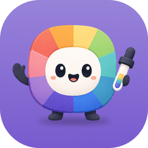

<p align="center">
  
</p>

# 🎨 ChromaKit

ChromaKit is an offline color conversion plugin for Figma that helps designers inspect, convert, and copy color values without leaving their design workflow. It supports multiple color spaces and generates ready-to-use code snippets for common web and application formats.

Built with React, TypeScript, Vite, Tailwind CSS, shadcn/ui using the native neutral theme, and Hugeicons.

## ✨ Features

- Convert between HEX, RGB, RGBA, HSL, HSB, OKLCH, LCH, and CMYK.
- Choose the source and target formats independently.
- Pick a color and adjust opacity.
- Syntax highlighting for CSS, SCSS, Tailwind CSS, JSX, and JSON snippets runs entirely offline.
- Copy individual converted values or ready-to-use CSS, SCSS, Tailwind v4, React JSX, and JSON snippets.
- Keyboard-accessible controls, input validation, and copy feedback.
- Light and dark themes using shadcn's neutral color tokens.
- No account, analytics, network requests, or document modifications.

## 🧩 Run in Figma

1. Run:

   ```sh
   pnpm build
   ```

2. Open the Figma desktop app.

3. From the Figma menu, go to **Plugins → Development → Import new plugin from manifest…** and select `apps/chromakit/manifest.json`.

4. Run **ChromaKit** from the Development section.

5. Rebuild and rerun the plugin after production changes. Use `pnpm dev` for live browser UI development.

Before the first publish, Figma assigns ChromaKit a unique plugin `id`. Add that `id` to `apps/chromakit/manifest.json` and rebuild before publishing. Keep the assigned ID in the manifest for future releases.

The plugin ID is public metadata and may be committed to the repository. Never commit access tokens, credentials, or other secrets.

Figma manages the native plugin title bar. The plugin UI does not render a second application header.
